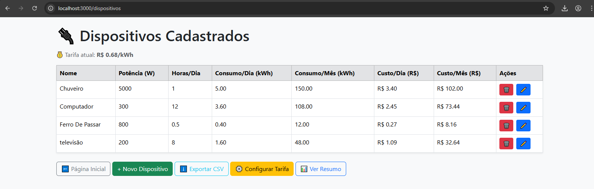
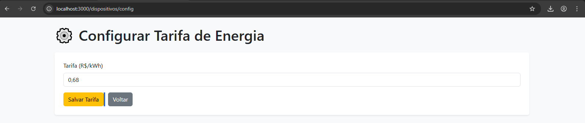
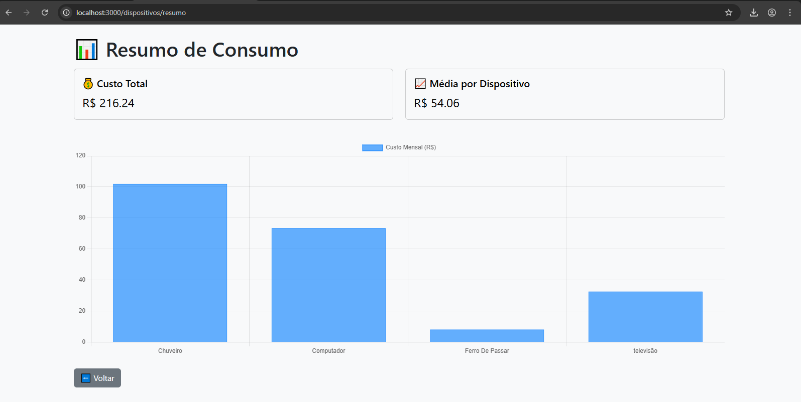

# PowerSim – Simulador de Consumo Elétrico

PowerSim é um sistema web simples, criado na intenção de colocar em pratica o que foi aprendido em sala de aula, que permite **simular, calcular e visualizar o consumo elétrico de dispositivos** em uma residência.  

Ele utiliza tecnologias modernas como **Node.js, Express, EJS, SQLite** e conta com interface amigável e exportação de dados.

---

## Preview

## Tabela de dispositivos


## Configurar tarifa


## Gráfico de resumo


---

## Funcionalidades

- Cadastro de dispositivos com potência e horas diárias de uso  
- Cálculo automático de consumo diário e mensal (em kWh e R$)  
- Interface com Bootstrap responsivo  
- Gráfico de consumo mensal por dispositivo (Chart.js)  
- Edição e exclusão de dispositivos  
- Configuração da tarifa de energia elétrica (R$/kWh)  
- Exportação dos dados em `.csv`  
- Pronto para integração futura com sensores de corrente

---

## Tecnologias Usadas

- [Node.js](https://nodejs.org/)
- [Express.js](https://expressjs.com/)
- [EJS](https://ejs.co/)
- [SQLite3](https://www.sqlite.org/index.html)
- [Knex.js](https://knexjs.org/)
- [Bootstrap 5](https://getbootstrap.com/)
- [Chart.js](https://www.chartjs.org/)
- [json2csv](https://www.npmjs.com/package/json2csv)

---

## Estrutura de Pastas

```
powersim/
├── src/
│   ├── views/             # Arquivos EJS da interface
│   ├── routes/            # Rotas Express (dispositivos.js)
│   ├── database/          # db.js e migrations
│   └── app.js             # Arquivo principal do servidor
├── public/                # Arquivos estáticos (CSS)
├── package.json
└── README.md
```


## Como rodar localmente

### Pré-requisitos:

- Node.js (v18+)
- Git

### Passos:

```bash
# Clone o projeto
git clone https://github.com/Samuel-MSilva/powersim

cd powersim

# Instale as dependências
npm install

# Rode as migrations iniciais (criação do banco)
node src/database/migrate.js

# Inicie o servidor
node src/app.js
```

Acesse [http://localhost:3000](http://localhost:3000) no navegador.

---

## Possibilidades Futuras

- Leitura real de corrente com sensores ACS712 ou PZEM-004T  
- API REST com endpoints para controle remoto  
- Dashboard em tempo real com WebSocket  
- Otimizações com aprendizado de máquina no uso dos dispositivos

---

## Licença

Projeto livre para fins educacionais e profissionais.  
Feito por [Samuel Martins Silva](https://github.com/seu-usuario)
